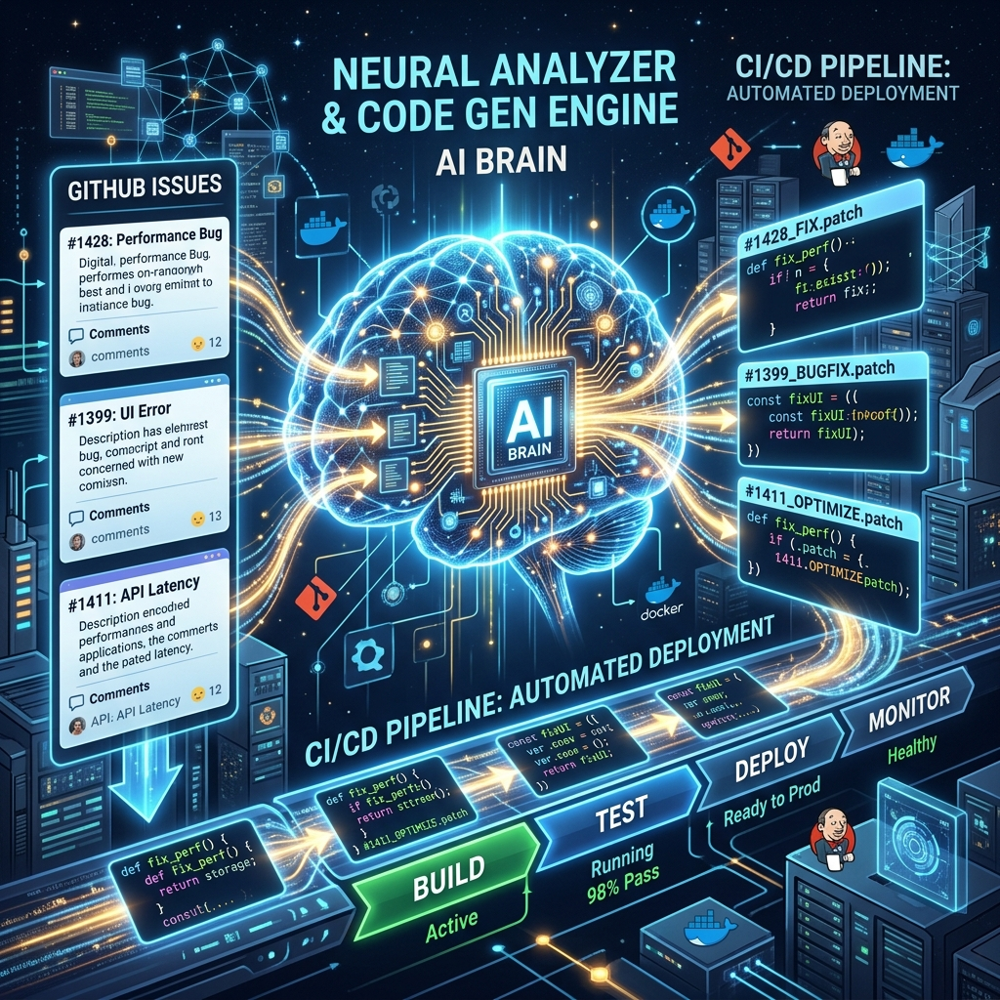

# ?? Autopilot Core: The Org-Level Control Plane

**Autopilot-Core** is the elite, organizational-level AI control plane. It acts as the central nervous system across the entire Coding-Autopilot-System ecosystem. It continuously scans for \utofix + queued\ GitHub issues across ALL repositories, delegates them to Codex, and automatically opens pristine Pull Requests.

## ?? Elite Features
* **Omnipresent Issue Scanning**: A global observer that polls organizational GitHub webhooks in real-time.
* **Codex Delegation Engine**: Automatically converts raw issue descriptions into highly-structured Codex execution prompts.
* **Org-Wide PR Generation**: Not restricted to a single repository; it manages code changes across an infinite number of linked projects simultaneously.

## ? Quickstart
1. Ensure Python 3.12+ is installed.
2. Clone and install:
   \\\ash
   pip install -e .
   \\\
3. Start the Control Plane watcher:
   \\\ash
   python -m autopilot_core.watcher
   \\\

---
*For a deep dive into the internal graph architecture, please see the [Wiki](WIKI/Home.md).*
