# Architecture

The **Autopilot Core** operates as an asynchronous, event-driven control plane for automatic code repair and AI operations across the organization's repositories. Rather than integrating deeply into every individual codebase, it utilizes a federated intake model mediated by standard GitHub Issues and GitHub Actions.

## High-Level Workflow

At its core, the architecture relies on a series of decoupled GitHub Actions workflows. A failure in an opted-in repository triggers an issue in `autopilot-core`, which acts as a central queue. An operator then processes this queue and proposes fixes.

```mermaid
sequenceDiagram
    participant Repo as Opted-in Repository
    participant Core as autopilot-core
    participant Codex as AI / Codex
    
    rect rgb(30, 30, 30)
    Note over Repo,Core: 1. Intake & Triaging
    Repo->>Repo: CI/CD Pipeline Fails
    Repo->>Core: Workflow Run triggers `autopilot-create-issue.yml`
    Core-->>Core: Issue created with labels `autofix + queued`
    end

    rect rgb(30, 45, 60)
    Note over Core,Codex: 2. Operator Execution
    loop Every 5 Minutes (Schedule)
        Core->>Core: `autopilot-operator.yml` scans for `autofix + queued` issues
        alt Issue has `risky` or `needs-design` label
            Core-->>Core: Skip execution
        else Valid Issue
            Core->>Codex: Prompt with issue details and codebase context
            Codex-->>Core: Generate minimal patch/fix
        end
    end
    end

    rect rgb(30, 60, 45)
    Note over Repo,Core: 3. Delivery & Verification
    Core->>Repo: Commit fix to new branch
    Core->>Repo: Open Pull Request
    Repo->>Repo: PR triggers CI/CD validation
    Repo->>Repo: Auto-merge or await human review
    end
```

## System Components

1. **Intake Workflows (`autopilot-create-issue.yml`)**
   - Installed via `autopilot-org-installer.yml` into target repositories.
   - Listens for `workflow_run` failure events.
   - Formats the failure context (logs, failing tests) into a structured GitHub issue payload and dispatches it to the `autopilot-core` queue.

2. **Operator (`autopilot-operator.yml`)**
   - Runs periodically on a self-hosted environment (e.g., Windows runner).
   - Polls `autopilot-core` issues.
   - Provides context to the `ci-autopilot` runtime agent.
   - Manages communication with the Codex / AI endpoints to generate a patch.

3. **Installer (`autopilot-org-installer.yml`)**
   - Scans the GitHub organization for repositories containing the `.autopilot/opt-in` marker.
   - Distributes updates to the intake workflows, ensuring standard reporting capabilities without manual setup per repository.

## Design Philosophy

- **Decoupled State**: The queue lives in GitHub Issues. There is no external database, meaning all state transitions are visible and auditable.
- **Fail-Safe Processing**: The operator acts with least-privilege tokens (`ORG_AUTOPILOT_TOKEN`), ensuring only opted-in codebases can be mutated.
- **Human-in-the-Loop Fallback**: Pull Requests generated by the system are just like human PRs. They run standard CI and can require mandatory human review if the repository policy dictates.
