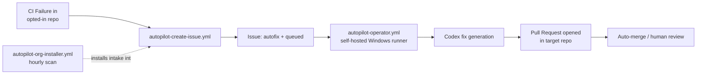

# Architecture

`autopilot-core` implements the intake-governance and operator-scheduling half of the CAS
autofix loop. It never touches target-repo code directly — it schedules the Codex-driven fix
generation and lets a pull request carry the change through normal review.

<!-- codex:generate-image prompt="A control tower overlooking rail yards, each track representing a GitHub repo; the tower issues a green dispatch ticket only after a failure signal arrives, an automated crane installs new track sections labeled autofix + queued; isometric, enterprise blue/graphite palette" style="isometric, enterprise, clean" replaces="mermaid-above" -->

## Components

| Component | Trigger | Purpose |
|---|---|---|
| `autopilot-create-issue.yml` | `workflow_run` failure | Creates the intake issue labeled `autofix + queued` |
| `autopilot-operator.yml` | schedule + `workflow_dispatch` | Scans issues, invokes Codex, opens PRs |
| `autopilot-org-installer.yml` | hourly + dispatch | Installs the intake workflow into repos that opt in via `.autopilot/opt-in` |
| `autopilot-docs-daily.yml` | daily | Refreshes the dashboard status page |

## Trust boundaries

- The operator only acts on issues labeled `autofix + queued` and skips `risky` or
  `needs-design` labels.
- Diffs are minimal by design — no secrets, no destructive operations — and required
  verification runs before a PR is opened.
- The operator requires the `ORG_AUTOPILOT_TOKEN` secret, scoped least-privilege for
  cross-repo mutation; it runs on a self-hosted Windows runner, not GitHub-hosted compute.
- This repo does not provision or deploy any cloud infrastructure; it is GitHub Actions
  orchestration plus a locally-hosted runner.

<!-- docs-verified: cd76345f0837ce2f710ad8bad7bbc9e3de9d5ff0 2026-07-08 -->
